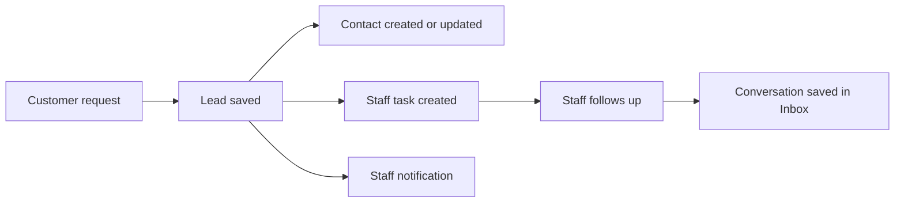

# 01. CRM Basics For Restaurant Owners

## Purpose

The CRM helps restaurant staff avoid missed customer requests. When someone submits a website form, sends a message, or asks for a reservation, the app saves the customer and creates the next staff action.

## Simple Terms

- **Lead:** a new customer request.
- **Contact:** the customer profile.
- **Task:** the staff action that must be done.
- **Inbox:** the conversation with the customer.
- **Deal:** a bigger business opportunity, such as private dining.
- **Segment:** a saved customer group.
- **Notification:** a staff alert.

## Workflow

## Screenshots

- `screenshots/02-tenant-login-result.png` - tenant dashboard after restaurant-owner login.
- `screenshots/crm-contacts.png` - Contacts page with the follow-up queue.
- `screenshots/crm-inbox.png` - Inbox page for SMS, WhatsApp, and email replies.
- `screenshots/crm-deals.png` - Deals pipeline for larger opportunities.
- `screenshots/crm-segments.png` - Segments page for saved customer groups.
- `screenshots/crm-duplicates.png` - Duplicate review page.
