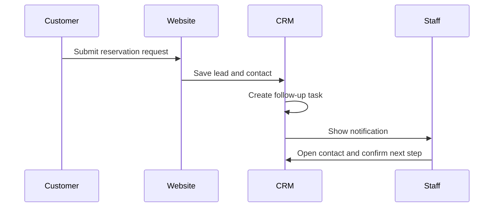

# 02. Customer Reservation To Contact And Task

## Business Goal

A visitor asks for a table. The restaurant should not lose the request, even if staff are busy.

## Test Inputs

- Customer name: masked in screenshots.
- Phone: masked Swiss test number.
- Email: masked test email.
- Request type: reservation.
- Preferred channel: SMS.

## Expected Automation

1. Website form is submitted.
2. CRM lead is created.
3. Contact is created or updated.
4. Staff task is created.
5. Staff notification appears.
6. Staff SMS alert may be sent to the verified business phone.
7. Customer acknowledgement can be sent through the configured channel.

## Screenshots

- `screenshots/01-customer-public-page.png` - customer-facing Abdi Restaurant page.
- `screenshots/crm-contacts.png` - tenant Contacts workspace where the lead and task should appear after submission.
- `screenshots/10-live-customer-open-page.png` - live customer view before submitting the restaurant request.
- `screenshots/11-live-customer-filled-form.png` - customer identity and preferred SMS channel filled in.
- `screenshots/12-live-customer-filled-second-step.png` - reservation details filled in.
- `screenshots/13-live-customer-submit-result.png` - successful browser form submission.
- `screenshots/14-live-tenant-dashboard.png` - tenant dashboard after the request was captured.
- `screenshots/15-live-tenant-crm.png` - CRM workspace after the request was captured.
- `screenshots/16-live-tenant-inbox.png` - Inbox workspace after the request was captured.

## Observed Status

The live browser pass submitted a restaurant reservation from the published page. The public form made a successful `POST` request to the form endpoint and received `{"ok":true}`.

The CRM database created:

- a `booking` lead
- workflow state `awaiting_confirmation`
- a contact matched by the submitted phone number
- an unread staff notification titled `New reservation request`

In plain English: the restaurant owner does not need to manually copy form submissions. The app turns the website request into a customer record, a reservation workflow, and a staff alert.

One UX note remains: if the CRM list is still loading during the screenshot, wait a few seconds or refresh. The backend record exists immediately after the successful form response.
