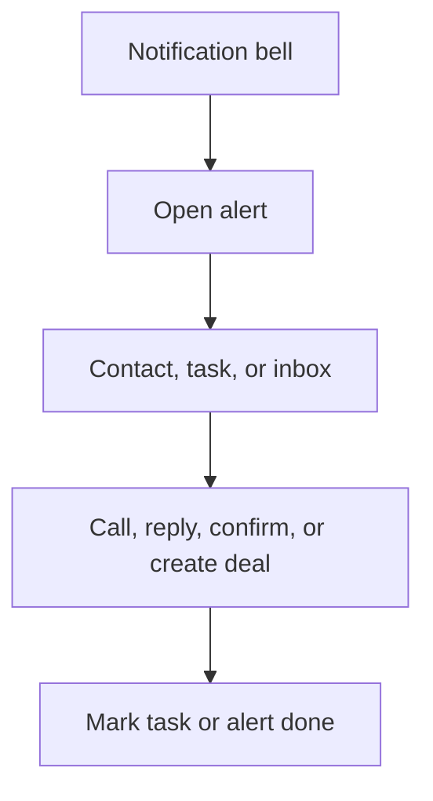

# 03. Notifications And Daily Staff Workflow

## Business Goal

Staff should not need to stare at the CRM all day. Important work should appear as an alert.

## What Notifications Mean

- **New reservation request:** someone wants a table.
- **Missing details:** staff must ask for date, time, or party size.
- **Customer replied:** the Inbox needs attention.
- **SMS delivery failed:** staff should try another channel.
- **Overdue task:** a follow-up is late.

## Staff Workflow

1. Staff logs in.
2. The notification bell shows unread alerts.
3. Staff opens an alert.
4. The alert sends staff directly to the contact, task, or inbox thread.
5. Staff completes the action and marks the alert done.

## Screenshots

- `screenshots/tenant-dashboard.png` - daily starting point for staff.
- `screenshots/crm-contacts.png` - where new lead tasks are reviewed.
- `screenshots/integrations-notifications.png` - where channel readiness and SMS settings are checked.
- `screenshots/14-live-tenant-dashboard.png` - live staff dashboard after a customer reservation.

## Observed Status

The live reservation test created an unread notification titled `New reservation request`.

For a restaurant owner, this means the CRM is not only a database. It becomes a daily work queue: when someone asks for a table, staff should see an alert, open the related customer record, and confirm the booking or ask for missing details.
