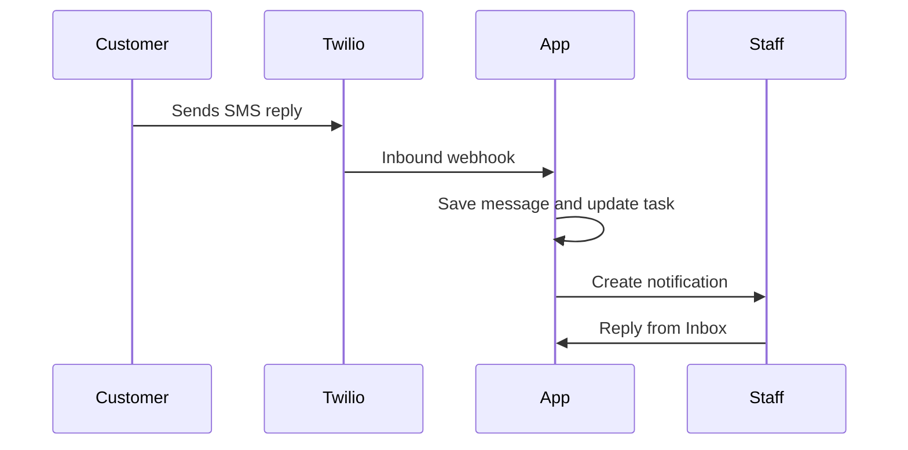

# 04. Inbox, SMS, And Two-Way Follow-Up

## Business Goal

When customers reply, staff should see the conversation and know what to do next.

## Expected Flow

1. Customer replies by SMS.
2. Twilio webhook is received.
3. Message appears in Inbox.
4. Staff notification is created.
5. CRM task is updated with the reply.
6. Staff replies from Inbox.

## Screenshots

- `screenshots/crm-inbox.png` - Inbox shell where SMS, WhatsApp, and email replies appear.

## Observed Status

The browser pass verified that the Inbox route renders and explains the staff workflow. A live inbound SMS reply was not sent during this pass, so the thread-level screenshots are still pending.
