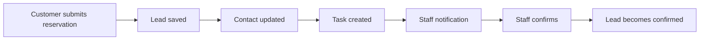

# Manual CRM Scenario Playbook For Abdi Restaurant

This guide is for checking the CRM without long browser automation. Follow each scenario as two people:

- **Customer**: a visitor using the published Abdi Restaurant page.
- **Tenant staff**: the restaurant owner or staff member using the SaaS dashboard.

Use simple screenshots while testing:

- public form before submit
- public success message
- CRM contact or task after submit
- notification drawer
- inbox message or automation issue
- final status after staff action

## Before You Start

### Tenant Login

Open the tenant dashboard:

```text
http://localhost:3000/en/dashboard
```

or production:

```text
https://marketing-web-pied-nine.vercel.app/en/dashboard
```

Login:

```text
Email: restaurant-owner@e2e.test
Password: E2eTestPass1!
```

### Published Restaurant Page

Local test page:

```text
http://localhost:3000/p/geneva-restaurant-e2e-jz3bc/abdi-restaurant-d5edaf2d
```

Production page:

```text
https://marketing-web-pied-nine.vercel.app/p/geneva-restaurant-e2e-jz3bc/abdi-restaurant-16a3690b
```

### Test Phone

Because Twilio is still in trial mode, use only the verified test number:

```text
+41762147690
```

### Production Staff SMS Checklist

When a customer submits a booking, the app should create two staff alerts:

- an in-app notification in the dashboard bell
- an SMS to the tenant's verified business phone

If the in-app notification appears but the SMS does not arrive, check these items in production:

```text
Vercel env:
SMS_PROVIDER=twilio
TWILIO_ACCOUNT_SID=...
TWILIO_AUTH_TOKEN=...
TWILIO_FROM_NUMBER=+14406246520
SMS_STATUS_CALLBACK_URL=https://marketing-web-pied-nine.vercel.app/api/integrations/twilio/sms/status
SMS_INBOUND_CALLBACK_URL=https://marketing-web-pied-nine.vercel.app/api/integrations/twilio/sms/inbound
APP_URL=https://marketing-web-pied-nine.vercel.app
DATABASE_POOL_MAX=3
```

```text
Fly worker env:
DATABASE_URL=same database as Vercel
REDIS_URL=same Redis as Vercel
SMS_PROVIDER=twilio
TWILIO_ACCOUNT_SID=...
TWILIO_AUTH_TOKEN=...
TWILIO_FROM_NUMBER=+14406246520
SMS_STATUS_CALLBACK_URL=https://marketing-web-pied-nine.vercel.app/api/integrations/twilio/sms/status
SMS_INBOUND_CALLBACK_URL=https://marketing-web-pied-nine.vercel.app/api/integrations/twilio/sms/inbound
APP_URL=https://marketing-web-pied-nine.vercel.app
DATABASE_POOL_MAX=3
```

After a booking test, you can inspect the latest staff SMS rows locally with:

```bash
node scripts/inspect-staff-sms-alerts.mjs geneva-restaurant-e2e-jz3bc 10
```

How to read the result:

- `queued`: Vercel created the SMS, but the worker has not processed it.
- `failed`: read `errorMessage`; it usually means plan, provider, quota, or Twilio rejected it.
- `sent`: Twilio accepted it. If the phone did not receive it, check Twilio Message Logs using the `externalId`.
- `delivered`: Twilio confirmed delivery through the status callback.

For the production checks on June 26, 2026, there were two separate states:

- Before the Fly worker redeploy, the newest production booking created a staff SMS row with status
  `queued` and no Twilio SID. That meant Vercel saved the alert, but the worker was not consuming it.
- After updating Fly secrets and deploying the current worker image, the worker consumed the queued SMS
  jobs. The newest staff alert received Twilio SID `SM0f64e7dcfe7265764626f7d281f3e490`, then Twilio
  marked it `undelivered` with error code `30008`.

That means the application handed the production message to Twilio. If the phone does not receive it,
check Twilio Message Logs by SID. At that point the issue is provider/carrier delivery, trial-recipient
verification, sender reputation, or Twilio geo/carrier rules rather than the app queue.

If a newer production booking creates a staff alert with status `queued` and no Twilio SID, the
worker has not sent it yet. Check Fly worker secrets:

```bash
fly secrets list --app marketing-workers
```

The worker must have the same production SMS settings as Vercel. At minimum it needs:

```text
DATABASE_URL
REDIS_URL
DATABASE_POOL_MAX=3
APP_URL
SMS_PROVIDER
TWILIO_ACCOUNT_SID
TWILIO_AUTH_TOKEN
TWILIO_FROM_NUMBER or TWILIO_MESSAGING_SERVICE_SID
SMS_STATUS_CALLBACK_URL
SMS_INBOUND_CALLBACK_URL
```

On June 26, 2026, Fly initially only had database, Redis, auth, and AI secrets. It was missing the
Twilio/SMS secrets, so new production staff SMS rows stayed `queued` and never appeared in Twilio logs.
After importing the SMS secrets and redeploying the worker image
`marketing-workers:deployment-01KW0MS1B99DSHCD71NNS4QDGA`, Fly consumed the queued SMS jobs.

## Scenario 1: Complete Reservation Request

### Goal

Prove that a normal customer reservation becomes CRM work for staff.

### Customer Action

Open the published restaurant page and submit the reservation/contact form.

Use this data:

```text
Name: Abdi CRM Manual Guest
Email: abdi.crm.manual@example.test
Phone: +41762147690
Date: 2026-07-04
Time: 19:30
Party size: 2
Preferred channel: SMS
Message: We would like a quiet table for two. Please confirm by SMS.
```

Click the submit/reservation button.

### Expected Customer Result

The page should show a success message. The customer should not see CRM details.

### Tenant Staff Action

Open:

```text
/en/dashboard
```

Click the notification bell.

### Expected Tenant Result

You should see a notification similar to:

```text
New reservation request
A customer submitted a restaurant request from your website. Open CRM to review and confirm.
```

Click **Open**.

### CRM Check

Open:

```text
/en/crm
```

Expected:

- Follow-up queue shows a reservation task.
- Contact exists or is updated.
- Contact source is website/form/landing page.
- Lead history shows reservation details.
- Workflow state is `Awaiting confirmation`.

### Staff Decision

In the follow-up queue, click:

```text
Confirm reservation
```

### Expected Final Result

- Lead status becomes `Confirmed`.
- Reservation workflow state becomes `Confirmed`.
- Related task is completed or removed from open tasks.
- A `reservation.status_changed` event can trigger SMS/email sequence automation if active.

### Business Meaning

The restaurant does not lose the request. Staff gets one clear task: confirm the table.



## Scenario 2: Reservation With Missing Details

### Goal

Prove that incomplete reservations do not disappear; they become staff follow-up.

### Customer Action

Submit the form with missing time and party size.

Use this data:

```text
Name: Missing Details Guest
Email: missing.details@example.test
Phone: +41762147690
Date: 2026-07-05
Time: leave empty if possible
Party size: leave empty if possible
Preferred channel: SMS
Message: I would like to reserve for tomorrow evening. Please contact me.
```

### Expected Tenant Result

CRM should show:

- New or updated contact.
- Reservation task.
- Workflow state: `Missing details` or equivalent.
- Staff should ask for the missing time and guest count before confirming.

### Staff Action

Open the contact or Inbox and send a manual reply:

```text
Abdi Restaurant: Thanks for your request. What time and how many guests should we reserve for?
```

### Expected Final Result

- Customer reply should appear in Inbox if inbound SMS/webhook is configured.
- Staff can update the reservation and confirm later.

### Business Meaning

The app helps staff recover incomplete leads instead of ignoring them.

## Scenario 3: Callback Request

### Goal

Prove that phone-based leads become callback tasks.

### Customer Action

Submit a form or message with:

```text
Name: Callback Guest
Email: callback.guest@example.test
Phone: +41762147690
Preferred channel: SMS or Phone
Message: Please call me about booking a table for this weekend.
```

### Expected CRM Result

- Contact is created or updated.
- Task says staff should call/contact the customer.
- Lead kind should be callback or generic follow-up if the form does not expose a callback preset.

### Staff Action

Open the task, call the customer outside the app, then mark the task done.

### Business Meaning

Staff gets a practical call list instead of scattered form submissions.

## Scenario 4: Private Dining Or Quote Request

### Goal

Prove that higher-value inquiries can become deals.

### Customer Action

Submit:

```text
Name: Private Event Guest
Email: private.event@example.test
Phone: +41762147690
Preferred channel: Email
Message: We want a private dinner for 18 people next month. Can you send a menu and price?
```

### Expected CRM Result

- Contact is created or updated.
- Lead/task appears.
- Staff should treat this as a sales opportunity.

### Staff Action

Open:

```text
/en/crm/deals
```

Create a deal:

```text
Title: Private dinner for 18 guests
Value: 1200
Stage: New or Qualified
Contact: Private Event Guest
```

### Expected Final Result

- Deal appears in pipeline.
- Contact history should make it clear this customer has a valuable event inquiry.

### Business Meaning

The restaurant can track larger opportunities separately from normal table bookings.

## Scenario 5: Inbox Reply And Follow-Up

### Goal

Prove that message replies are not hidden; they become staff conversations.

### Customer Action

Reply by SMS/WhatsApp if inbound webhook is configured, or use an existing inbound thread.

Example message:

```text
Hi, can we change the reservation to 20:00?
```

### Tenant Staff Action

Open:

```text
/en/crm/inbox
```

### Expected Result

- Thread appears or updates.
- Inbox shows customer message.
- If staff action is needed, a notification/task should appear.

### Staff Reply

Send:

```text
Abdi Restaurant: Yes, we moved your request to 20:00. We will confirm shortly.
```

### Business Meaning

Inbox is the daily customer conversation center.

## Scenario 6: Segments For Reservation Leads

### Goal

Group customers so the restaurant can follow up later.

### Tenant Staff Action

Open:

```text
/en/crm/segments
```

Create a segment:

```text
Name: Reservation leads
Rule idea: contacts with booking leads or reservation tag
Purpose: send future dinner offers or review requests only to relevant customers
```

### Expected Result

Segment appears and can be used by automation later.

### Business Meaning

The restaurant can target real customers without sending every message to everyone.

## Scenario 7: Duplicates And Returning Customers

### Goal

Prove repeated submissions from the same person do not create a messy CRM.

### Customer Action

Submit another reservation using the same phone:

```text
Phone: +41762147690
Email: abdi.crm.manual@example.test
```

### Tenant Staff Action

Open:

```text
/en/crm/duplicates
```

### Expected Result

- If duplicate candidates exist, the page should explain what matches.
- Merge should be cautious and easy to understand.
- Existing customer history should remain visible.

### Business Meaning

Staff can see returning customers and avoid fragmented records.

## Scenario 8: Email Or SMS Sequence Follow-Up

### Goal

Prove that automation can follow up after a lead is captured or confirmed.

### Tenant Staff Action

Open:

```text
/en/sequences
```

Create or inspect a sequence:

```text
Name: Reservation follow-up
Trigger: reservation confirmed
Step 1: confirmation/reminder
Step 2: post-visit thank-you or review request
```

For SMS, keep messages short:

```text
Abdi Restaurant: Thanks for visiting. We hope you enjoyed dinner. Reply if you need anything.
```

### Expected Result

- Sequence exists.
- It is inactive until staff reviews and activates it.
- Real SMS sends should respect quota, consent, and opt-out.

### Business Meaning

Staff does not need to remember every reminder or thank-you manually.

## Scenario 9: Failed Automation

### Goal

Prove staff can see when automation fails.

### Trigger

Use a bad number in a controlled test:

```text
+41000000000
```

Do not use this for real customer messaging.

### Expected Result

- SMS should fail safely.
- Inbox or Integrations should show attention needed.
- Contact timeline should not pretend the message was delivered.

### Business Meaning

The business can trust the app because failures are visible.

## What To Send Back To Codex If Something Fails

For any failed scenario, send:

1. Which scenario number you tested.
2. The exact URL.
3. Screenshot of the page.
4. Browser console error if any.
5. The data you typed, with phone/email masked if needed.
6. What you expected.
7. What happened instead.

## CRM Terms In Plain English

- **Contact**: one customer profile.
- **Lead**: one request or inquiry from that customer.
- **Task**: what staff must do next.
- **Inbox**: customer conversations from SMS, WhatsApp, or email.
- **Deal**: a bigger sales opportunity, like private dining.
- **Segment**: a saved group of customers.
- **Sequence**: automatic follow-up messages over time.
- **Notification**: a bell alert that tells staff something needs attention.
