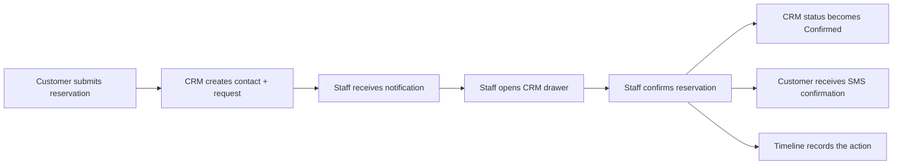

```mermaid
flowchart LR
  A[Customer submits reservation] --> B[CRM creates contact + request]
  B --> C[Staff receives notification]
  C --> D[Staff opens CRM drawer]
  D --> E[Staff confirms reservation]
  E --> F[CRM status becomes Confirmed]
  E --> G[Customer receives SMS confirmation]
  E --> H[Timeline records the action]
```
