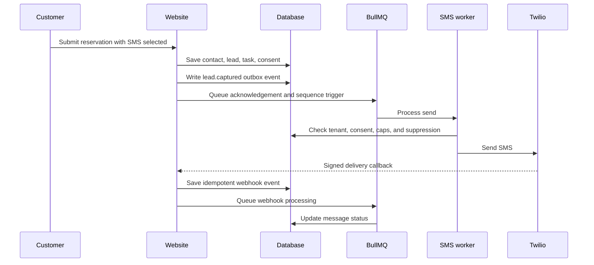

# SMS System Overview

## Purpose

SMS is a fast follow-up channel for leads who provide a phone number. For Abdi Restaurant it is used
for reservation acknowledgements, missing-detail questions, confirmations, reminders, and reviewed
thank-you messages.

## Main parts

| Part                   | Responsibility                                                                              |
| ---------------------- | ------------------------------------------------------------------------------------------- |
| Published website/form | Collects name, phone, preferred channel, date, time, party size, and notes.                 |
| CRM                    | Stores the contact, lead, reservation facts, source, and status.                            |
| Outbox and queues      | Move work safely to background workers.                                                     |
| SMS send worker        | Applies consent, caps, length limits, plan entitlement, and sender rules before Twilio.     |
| Twilio                 | Sends the SMS and calls the delivery/inbound webhooks.                                      |
| SMS webhook worker     | Stores delivery updates, customer replies, STOP/START, media metadata, and extracted facts. |
| Inbox                  | Gives staff one place to read and reply.                                                    |
| SMS automation         | Stores templates, sequences, enrollments, timing, and AI drafts.                            |

## Tenant-safe sender order

1. Use the platform-managed Twilio sender when the tenant has SMS entitlement.
2. In development/demo mode, `SMS_TEST_MODE_ENABLED=true` allows platform SMS for all tenants under
   your control, even when their plan would normally block real SMS.
3. Keep encrypted tenant-owned Twilio credentials as a hidden enterprise override only.
4. Reject the send or webhook if tenant routing is ambiguous.

For inbound replies on the shared platform sender, routing is based on the most recent outbound SMS
sent to that customer phone. That is good enough for demos and simple production use, while larger
tenant-owned sender setups can use the enterprise override later.

## Message states

| Status        | Plain-English meaning                       |
| ------------- | ------------------------------------------- |
| `queued`      | Saved and waiting for the worker.           |
| `sent`        | Twilio accepted the message.                |
| `delivered`   | The carrier reported delivery.              |
| `undelivered` | Twilio or the carrier could not deliver it. |
| `failed`      | The send was blocked or failed permanently. |

## Safety rules

- Phone numbers must use international format, such as `+41...`.
- SMS body length is limited to 459 characters.
- The UI estimates message segments because long SMS messages cost more.
- Europe/Zurich quiet hours default to `20:00-08:00`.
- Tenant, sequence, and contact daily limits apply.
- Promotional sequence steps require explicit SMS consent.
- Transactional replies are allowed after an explicit reservation or service request.
- STOP suppresses non-essential SMS. START restores the active preference.
- AI drafts never activate themselves.

## Architecture

