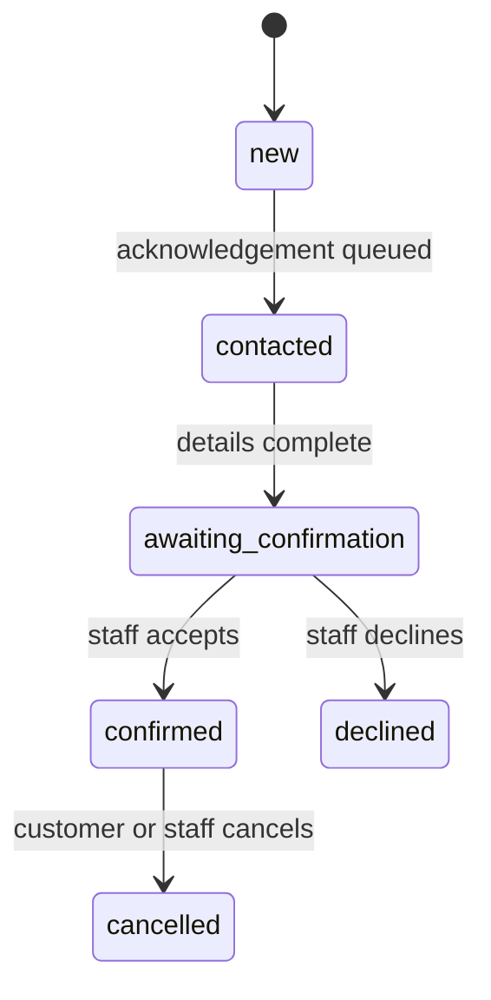

# Restaurant Reservation Golden Path

## Business situation

A visitor wants a table at Abdi Restaurant. The visitor prefers SMS because it is faster than
email. The restaurant must acknowledge the request immediately but must not promise a confirmed
table until staff reviews availability.

## Customer input

Use masked test data in documentation:

| Field             | Example                      |
| ----------------- | ---------------------------- |
| Name              | `SMS Test Guest`             |
| Email             | optional                     |
| Phone             | `+41 ** *** ** **`           |
| Preferred contact | `SMS`                        |
| Date              | a future date                |
| Time              | `19:30`                      |
| Party size        | `4`                          |
| Message           | `Window table if available.` |

## Expected flow

1. The public form validates the fields.
2. The platform saves a contact and a booking lead.
3. Structured data stores date, time, party size, and note.
4. A CRM task asks staff to review the reservation.
5. The lead starts as `new`.
6. A transactional acknowledgement is queued.
7. After a successful acknowledgement attempt, the lead becomes `contacted`.
8. Staff reviews availability.
9. Staff changes the reservation to `confirmed`.
10. The `reservation.status_changed` event enrolls the confirmation sequence.
11. Twilio delivery callbacks update the message to `delivered` or an error state.

## Verified browser steps

### 1. Public restaurant page

The existing public slug was preserved. The page now uses the tenant profile location,
`Neuchatel, Switzerland`, and the navigation action says `Reserve a table`.

### 2. Reservation and channel form

The form supports email, phone call, SMS, and WhatsApp. The customer can provide phone-only contact
data when SMS is the chosen channel.

### 3. Mobile experience

The generated website uses a mobile navigation control and keeps the reservation experience
readable on a narrow screen.

## Observed outcome

The page, mobile layout, form fields, channel choices, Twilio readiness, and tenant automation
screens passed Playwright verification on June 24, 2026. A real form submission was intentionally
not made because it would trigger an external SMS and the deployed callback routes are not live yet.
