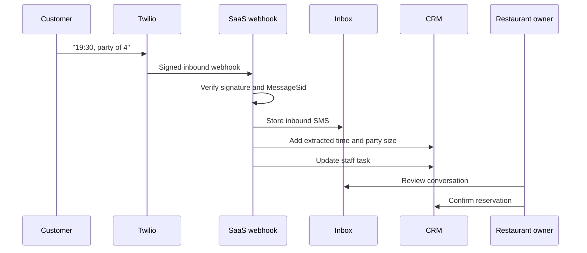

# Missing Details and Two-Way Replies

## Business situation

A visitor asks for a table but forgets the time or party size. The restaurant needs a polite
follow-up instead of losing the lead.

## Expected automation

1. The form or inbound SMS creates the contact and lead.
2. The lead workflow state becomes `missing_details`.
3. A staff task explains what is missing.
4. The immediate acknowledgement confirms receipt without confirming a table.
5. The `Reservation details recovery` sequence asks for time and number of guests.
6. The customer replies to the Twilio number.
7. Twilio signs and sends the inbound webhook.
8. The app stores the reply once using `MessageSid`.
9. The Inbox displays the reply.
10. The worker extracts supported facts, such as `19:30`, `party of 4`, or `2026-07-10`.
11. The CRM lead and latest open task are updated.
12. Staff confirms or declines the request.

## Supported inbound behavior

- Plain text replies are stored.
- Basic time, date, and party-size facts are extracted.
- Media messages are stored with media URL metadata and a safe placeholder.
- `HELP` queues a short assistance reply.
- Unsupported text remains visible for staff rather than being discarded.

## Browser evidence

The Inbox loads with SMS as a first-class channel. It will show the live thread after the production
webhooks are deployed and a test reply is received.

## Manual test after deployment

1. Submit the reservation form with SMS selected and omit time.
2. Receive the acknowledgement at the verified test phone.
3. Reply from that phone with `19:30, party of 4`.
4. Open `CRM -> Inbox -> SMS`.
5. Confirm the inbound bubble, lead facts, and task update.
6. Mark the reservation confirmed.
