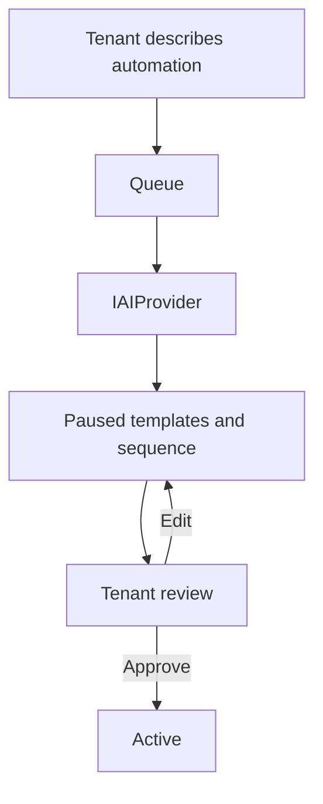

# SMS Templates and Sequences

## Why sequences matter

A sequence turns repeated staff work into a controlled workflow. It is not a free-form autonomous
agent. Each step has approved copy, a delay, a purpose, and a clear trigger.

## Restaurant presets

The platform installs these reusable templates:

| Template                    | Purpose                                         |
| --------------------------- | ----------------------------------------------- |
| Missing reservation details | Ask for time and party size.                    |
| Reservation confirmed       | Confirm the staff-approved booking.             |
| Reservation reminder        | Remind the guest after confirmation.            |
| Post-visit thank you        | Optional marketing follow-up; consent required. |

The preset sequences are:

- `Reservation details recovery`: triggered by `lead.captured` when a booking has missing details.
- `Confirmed reservation follow-up`: triggered by `reservation.status_changed` when the workflow
  becomes `confirmed`.

## Manual sequence creation

The tenant chooses:

1. sequence name
2. trigger event
3. lead kind
4. optional workflow state
5. template for each step
6. wait time in minutes
7. transactional or marketing purpose
8. activation status

New sequences are saved paused unless the tenant explicitly activates them.

## AI-assisted creation

1. The tenant describes the business purpose.
2. A queued AI workflow calls `IAIProvider`.
3. AI returns a sequence name, trigger, filter, timing, and message drafts.
4. Templates and the sequence are stored in paused state.
5. The tenant reviews the wording and timing.
6. The tenant activates the sequence.

AI cannot send or activate by itself.

## Enrollment behavior

- Event enrollment is idempotent for the same sequence and contact.
- Manual enrollment uses a searchable phone-contact picker.
- Enrollments can be paused, resumed, exited, completed, suppressed, or failed.
- The scheduler runs every minute.
- Quiet hours move a due step to the next allowed time.
- A sequence daily cap prevents accidental volume spikes.

## Browser evidence

