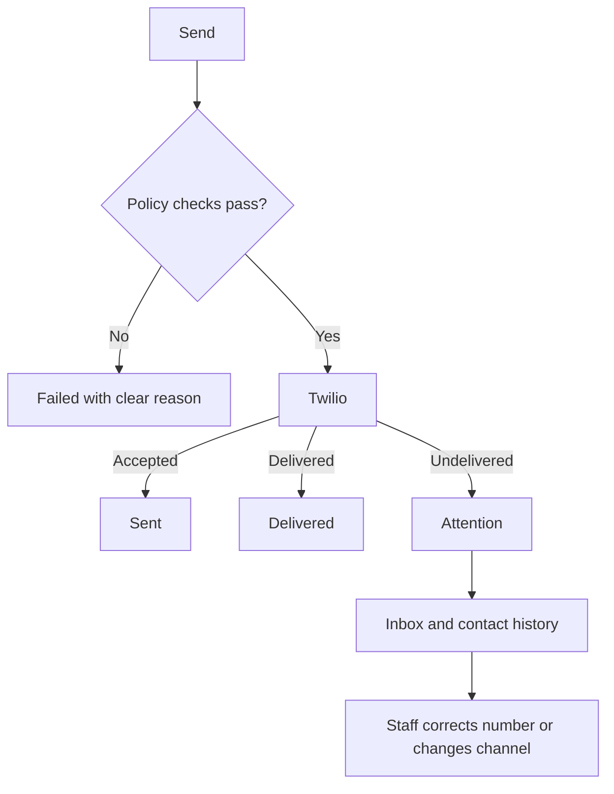

# Opt-Out, Failures, and Recovery

## STOP and START

When a customer sends `STOP`, `UNSUBSCRIBE`, `END`, `QUIT`, `STOPALL`, `REVOKE`, or `OPTOUT`:

1. the inbound message is stored
2. the tenant-scoped SMS preference becomes `opted_out`
3. marketing consent becomes false
4. active sequence enrollments for that contact become `suppressed`
5. later non-essential SMS steps are skipped

When the customer sends `START`, `UNSTOP`, or `YES`, the preference becomes active again. Marketing
still requires an appropriate consent record.

## Failure types

| Failure                     | Platform response                                        |
| --------------------------- | -------------------------------------------------------- |
| Invalid phone format        | Reject before queueing.                                  |
| Missing tenant credentials  | Keep the tenant isolated and show SMS as not configured. |
| Missing marketing consent   | Mark the marketing send failed without calling Twilio.   |
| Contact opted out           | Block non-essential sequence sends.                      |
| Daily cap reached           | Retry later or defer the sequence.                       |
| Message over 459 characters | Reject before Twilio.                                    |
| Twilio API failure          | Retry with exponential backoff, then mark failed.        |
| Carrier undelivered         | Delivery callback sets `undelivered` with error details. |
| Duplicate webhook           | Unique event key prevents duplicate processing.          |

## Recovery workflow

## Safe test cases

- Enter a malformed phone number and confirm browser validation without sending.
- Use a signed webhook fixture twice and confirm only one inbound message is stored.
- Send `STOP` from the verified test phone after deployment.
- Confirm a later marketing sequence step is suppressed.
- Keep transactional reservation handling visible to staff.

## Production note

The Vercel callback routes must return something other than `404` before real delivery and STOP tests.
On June 24, 2026, both deployed Twilio routes returned `404`, so live external tests were correctly
deferred.
