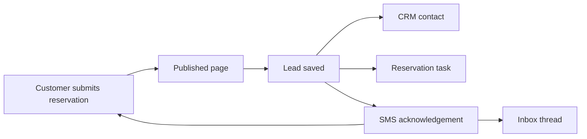

# Live Tenant and Customer Verification Guide

This guide explains how to test the restaurant SMS automation like a real business owner and a real
customer. It is written for a tenant who does not know the technical implementation.

Use the Abdi Restaurant demo first. The same workflow later applies to cafes, hotels, clinics,
retailers, and service businesses.

## What this test proves

By the end of the test, you should understand how the platform helps a restaurant:

- publish a website or landing page that captures leads
- verify the restaurant business phone number
- use platform-managed SMS without creating a Twilio account
- let a customer request a reservation and choose SMS follow-up
- save the customer in CRM automatically
- create a staff task automatically
- send or queue an SMS acknowledgement
- record customer replies in the Inbox
- let staff confirm, decline, or ask for missing details
- use SMS templates and sequences for controlled follow-up
- respect opt-out and failed-message handling

## Roles used in the test

| Role               | What they do                                                                  |
| ------------------ | ----------------------------------------------------------------------------- |
| Restaurant owner   | Logs into the SaaS dashboard, checks integrations, CRM, Inbox, and automation |
| Restaurant visitor | Opens the public restaurant page and submits a reservation request            |
| Platform           | Creates leads, contacts, tasks, messages, delivery records, and automation    |
| Twilio             | Delivers SMS and sends delivery or inbound reply callbacks                    |

For Twilio trial mode, the customer phone number must be a verified recipient in Twilio. In normal
tenant usage, the tenant does not enter Twilio credentials. The platform sender sends SMS, and the
tenant verifies only their business phone number.

## Before you start

### 1. Confirm the deployed callback routes exist

Open or probe these routes after deployment:

```text
https://marketing-web-pied-nine.vercel.app/api/integrations/twilio/sms/inbound
https://marketing-web-pied-nine.vercel.app/api/integrations/twilio/sms/status
```

They should not return `404`.

For a bad test POST, `400 Missing MessageSid` is acceptable. That means the route exists and is
rejecting incomplete Twilio data safely.

### 2. Confirm production environment values

The production web app and workers must both have:

```text
SMS_PROVIDER=twilio
TWILIO_ACCOUNT_SID=<your Twilio account SID>
TWILIO_AUTH_TOKEN=<your Twilio auth token>
TWILIO_FROM_NUMBER=<your Twilio SMS number>
SMS_TEST_MODE_ENABLED=true
SMS_TEST_TENANT_SLUG=geneva-restaurant-e2e-jz3bc
SMS_INBOUND_CALLBACK_URL=https://marketing-web-pied-nine.vercel.app/api/integrations/twilio/sms/inbound
SMS_STATUS_CALLBACK_URL=https://marketing-web-pied-nine.vercel.app/api/integrations/twilio/sms/status
```

Do not paste secrets into screenshots or documentation.

### 3. Confirm the tenant plan allows SMS

Open `Integrations` and check the SMS card:

| Plan    | Expected SMS behavior                                      |
| ------- | ---------------------------------------------------------- |
| Trial   | Real SMS blocked unless this is the configured demo tenant |
| Starter | Up to 50 SMS per month                                     |
| Growth  | Up to 500 SMS per month                                    |

If the panel says `Upgrade required`, the tenant can still collect leads, but real SMS sending is
blocked until the plan includes SMS.

### 4. Confirm Twilio configuration

In Twilio, configure the SMS number:

| Twilio setting              | Value                                                                 |
| --------------------------- | --------------------------------------------------------------------- |
| Incoming message webhook    | `/api/integrations/twilio/sms/inbound`                                |
| Delivery status callback    | `/api/integrations/twilio/sms/status`                                 |
| HTTP method                 | `POST`                                                                |
| Trial recipient restriction | The customer test phone must be verified in Twilio if using trial SMS |

## Scenario 1: Tenant checks SMS readiness

### Goal

The restaurant owner confirms that SMS automation is available and verifies the business phone before
collecting customer leads.

### Steps

1. Log in to the deployed app as the restaurant tenant.
2. Open `Integrations`.
3. Find the SMS automation panel.
4. Confirm the panel says SMS is platform-managed.
5. Confirm the plan, monthly limit, and remaining SMS count.
6. Enter the restaurant business phone number in E.164 format, for example `+41...`.
7. Click `Send code`.
8. Enter the verification code received by SMS.
9. Confirm the status says `Ready`.
10. If there is a diagnostic test button, send only one diagnostic SMS to the verified test number.

### Expected result

- The panel clearly shows SMS is ready.
- The business phone is marked verified.
- The tenant never sees Account SID, auth token, or sender-number credential fields in the normal UI.
- A diagnostic message is queued or sent.
- The message appears in recent sends, Inbox, or CRM history depending on the current UI.
- Twilio should show a message record in its dashboard.

### Business meaning

The restaurant owner knows the channel is available, their business phone is trusted, and the
platform handles the SMS provider setup for them.

## Scenario 2: Customer requests a complete reservation

### Goal

The customer uses the published restaurant page to request a table and chooses SMS as the follow-up
channel.

### Customer steps

1. Open the published Abdi Restaurant page.
2. Go to the reservation or contact form.
3. Enter:
   - name
   - email if requested
   - verified phone number
   - date
   - time
   - party size
   - notes if needed
4. Choose `SMS` as the preferred channel.
5. Submit the form.

### Expected customer result

- The page shows a success message.
- The customer receives an SMS acknowledgement if live sending is enabled.
- The acknowledgement should say the request was received and staff will confirm shortly.
- It should not say the booking is confirmed unless staff actually confirms it.

### Tenant steps

1. Open the SaaS dashboard.
2. Open `CRM`.
3. Find the new contact or lead.
4. Open `CRM -> Inbox`.
5. Look for the SMS thread.
6. Open tasks or the contact timeline.

### Expected tenant result

- A contact is created or updated.
- A lead is created with source from the website or form.
- A reservation task is created for staff.
- Reservation facts are visible: date, time, party size, phone, and notes.
- The workflow state moves to `contacted` after the acknowledgement path runs.

### Business meaning

The restaurant does not manually copy reservation requests from forms into a spreadsheet. The
platform creates the CRM record, task, and communication trail automatically.



## Scenario 3: Tenant confirms the reservation

### Goal

The restaurant owner or staff member confirms the booking after reviewing the request.

### Steps

1. Open the reservation lead or task.
2. Check date, time, and party size.
3. Change the reservation state to confirmed if the UI exposes this action.
4. Send the confirmation SMS using a reviewed template or staff-written message.

### Expected result

- The lead status becomes `confirmed`.
- A confirmation SMS is sent or queued.
- The message is attached to the customer thread.
- Delivery status eventually changes to `sent`, `delivered`, `failed`, or `undelivered`.

### Business meaning

Automation helps with speed, but staff stays in control of the real business commitment.

## Scenario 4: Customer submits missing details

### Goal

The platform handles incomplete reservation requests without losing the customer.

### Customer steps

1. Submit a reservation request without a time or party size.
2. Choose SMS as preferred channel.

### Expected system result

- A lead is created.
- The workflow is marked as missing details or awaiting staff review.
- A task tells staff what is missing.
- Staff can ask the customer for the missing information by SMS.

### Customer reply

Reply from the verified phone with a short message, for example:

```text
We are 4 people at 19:30 tomorrow.
```

### Expected tenant result

- The inbound SMS appears in Inbox.
- The contact thread is updated.
- Extracted facts may update the lead or task notes.
- Staff can then confirm or decline.

### Business meaning

Incomplete leads are not dead leads. The platform turns them into a clear staff follow-up workflow.

## Scenario 5: SMS templates and sequences

### Goal

The restaurant owner uses reusable follow-up messages instead of writing every SMS from scratch.

### Tenant steps

1. Open `SMS Automation` or the automation section.
2. Install or review restaurant presets.
3. Review templates such as:
   - missing reservation details
   - reservation confirmed
   - day-before reminder
   - post-visit thank-you
4. Review the sequence timing.
5. Keep the sequence inactive until the wording is correct.
6. Activate only the sequence you want to test.

### Expected result

- The tenant can see message length and sequence timing.
- The tenant can pause or stop enrollments.
- Promotional or review-request messages should require consent.
- Transactional reservation messages can be sent when they directly relate to the customer request.

### Business meaning

The owner can standardize good follow-up while still reviewing the communication before it becomes
active.

## Scenario 6: STOP and recovery

### Goal

The platform respects customer opt-out.

### Customer step

Reply:

```text
STOP
```

### Expected result

- The customer is suppressed for non-essential SMS.
- Future marketing or sequence SMS should be skipped.
- The tenant can still see the customer and history in CRM.
- Essential operational handling should require careful policy decisions.

### Business meaning

This protects the business from sending unwanted messages and helps keep the system compliant.

## What to check in Twilio

For each real SMS, open Twilio messaging logs and check:

- message SID
- from number
- to number
- status
- error code if failed
- callback URL used

Common trial-mode issues:

| Problem                           | Meaning                                                  |
| --------------------------------- | -------------------------------------------------------- |
| Recipient not verified            | Twilio trial account can only send to verified numbers   |
| Sender cannot send to destination | Sender number or account may not support that country    |
| Callback returns 404              | Vercel does not have the route deployed                  |
| Callback signature invalid        | Callback URL in Twilio does not exactly match app config |
| Message queued but never updates  | Worker or callback route is not running correctly        |

## What success looks like

The test is successful when:

- the customer submits a reservation from the public page
- the customer receives an SMS acknowledgement
- the tenant sees the lead in CRM
- the tenant sees the SMS thread in Inbox
- staff can confirm the reservation
- the confirmation SMS is recorded
- an inbound customer reply appears in the Inbox
- delivery status is visible
- STOP prevents future non-essential sequence messages

## What to document during the test

For each scenario, capture:

- screenshot of the customer form
- screenshot of the success message
- screenshot of the CRM contact or lead
- screenshot of the Inbox thread
- screenshot of the task or reservation status
- screenshot of Twilio message status
- whether the real phone received the SMS

Mask personal phone numbers and emails in any screenshots shared outside the team.
