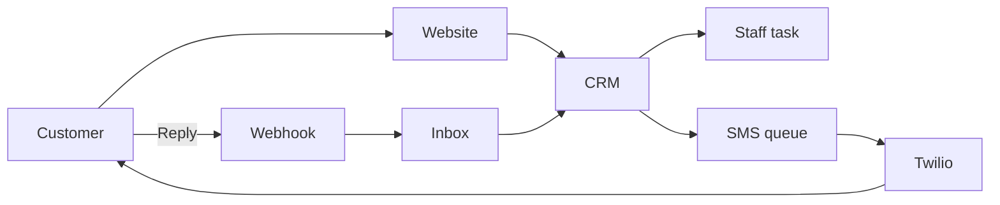

# Restaurant SMS Automation

This folder explains how Abdi Restaurant uses the platform to capture reservation leads and follow
them up by SMS.

## Current verification status

| Area                               | Status                     | Evidence                                                                                                  |
| ---------------------------------- | -------------------------- | --------------------------------------------------------------------------------------------------------- |
| Published restaurant page          | Verified locally           | [Golden path](02-restaurant-reservation-golden-path.md)                                                   |
| SMS channel selection              | Verified locally           | [Reservation form screenshot](screenshots/02-restaurant-golden-path/02-reservation-form-channels.png)     |
| Platform-managed SMS resolution    | Ready locally              | [Provider screenshot](screenshots/01-provider-readiness/01-twilio-health-no-send.png)                     |
| Tenant business phone verification | Implemented in app         | [Live verification guide](07-live-tenant-and-customer-verification-guide.md)                              |
| Restaurant SMS presets             | Installed and verified     | [Automation screenshot](screenshots/04-sms-templates-and-sequences/01-restaurant-presets-and-builder.png) |
| CRM Inbox                          | Verified locally           | [Inbox screenshot](screenshots/03-missing-details-and-two-way-replies/01-crm-inbox-before-replies.png)    |
| Real delivery and inbound reply    | Requires live verification | Follow the deployed-app checklist after Vercel and workers have the Twilio environment values.            |

No real SMS was sent during the no-send verification pass.

## Guides

1. [SMS system overview](01-sms-system-overview.md)
2. [Restaurant reservation golden path](02-restaurant-reservation-golden-path.md)
3. [Missing details and two-way replies](03-missing-details-and-two-way-replies.md)
4. [SMS templates and sequences](04-sms-templates-and-sequences.md)
5. [Opt-out, failures, and recovery](05-opt-out-failures-and-recovery.md)
6. [Tenant operations and production checklist](06-tenant-operations-and-production-checklist.md)
7. [Live tenant and customer verification guide](07-live-tenant-and-customer-verification-guide.md)

## Main business result

A restaurant owner does not need to copy form submissions into a phone or spreadsheet. The platform
owns the SMS provider setup, verifies the restaurant business phone, creates the CRM lead, keeps the
reservation facts together, creates staff work, sends approved SMS messages within plan limits,
records customer replies, and shows delivery problems in one place.

